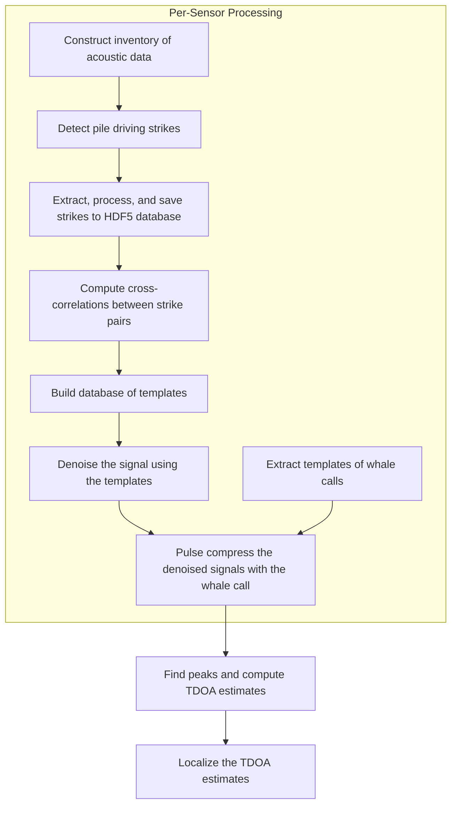

# RODEO II - Vineyard Wind Data Analysis Workflow

William Jenkins, Ph.D.  
Scripps Institution of Oceanography
University of California San Diego

This repository depends on the [`rodeo`](https://github.com/NeptuneProjects/RODEO-II) Python package.

## Workflow

The general workflow is as follows:


## Configuration

The entire workflow can be configured using two configuration files: `config/config.toml` and `config/inventory.toml`.

`config/config.toml` contains general settings for the workflow, such as paths to data directories, parameters for processing steps, and settings for parallelization.
`config/inventory.toml` specifies the acoustic data files to be processed and the parameters for processing them.

## Running workflow end-to-end

The entire workflow can be run end-to-end using the command:  
```bash
workflow run --config config/config.toml
```

The optional `--config` flag specifies the path to the configuration file, which contains settings for the workflow.
If the flag is not provided, the workflow will look for a default configuration file at `config/config.toml`.

## Running individual steps

The individual steps of the workflow can be run using the following commands:
1. Run the ETL job:
   `workflow etl --config config/config.toml`
2. Run all data processing steps:  
   `workflow process --config config/config.toml`

## Remaining Steps

- [ ] Detect whale calls. Suggest 1) filtering the final trace to 15-30 Hz to remove noise and 2) conduct peak detection on the entire denoised signal. This will allow tracking of whale calls including when pile driving is not occurring. Overlaying periods of pile driving with the whale call detections might yield insights.
- [ ] Localize the whale calls using the TDOA estimates.
- [ ] Estimate levels. Compare to the original signal and the denoised signal. This will help us understand how much of the pile driving noise is being removed by the filtering step.

<!-- 
9. Pulse compress the denoised signals with the whale call:  
   `python scripts/process/denoised_pulse_compression.py`
10. Find peaks and compute TDOA estimates:  
   `python scripts/process/tdoa_compute.py`
11. Localize the TDOA estimates:  
    `python scripts/process/tdoa_localize.py`
-->