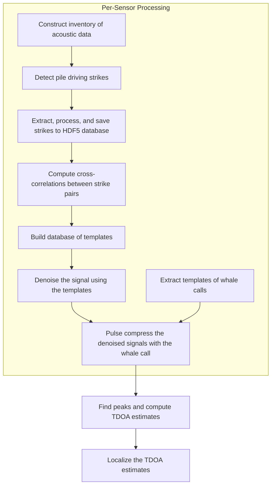

# RODEO II - Vineyard Wind Data Analysis Workflow

William Jenkins, Ph.D.  
Scripps Institution of Oceanography
University of California San Diego

This repository contains code used for analyses that have been submitted for peer review to the following publication:
> Jenkins, W. F. and Lin, Y.T. Passive acoustic tracking of a fin whale during pile driving at an offshore wind construction site. *Scientific Reports* (2026).

This repository depends on the [`rodeo`](https://github.com/NeptuneProjects/RODEO-II) Python package.

## Workflow

The general workflow is as follows:


## Configuration

The entire workflow can be configured using two configuration files: `config/config.toml` and `config/inventory.toml`.

`config/config.toml` contains general settings for the workflow, such as paths to data directories, parameters for processing steps, and settings for parallelization.
`config/inventory.toml` specifies the acoustic data files to be processed and the parameters for processing them.

## Running workflow end-to-end

The entire workflow can be run end-to-end using the command:  
```bash
workflow run --config config/config.toml
```

The optional `--config` flag specifies the path to the configuration file, which contains settings for the workflow.
If the flag is not provided, the workflow will look for a default configuration file at `config/config.toml`.

## Running individual steps

The individual steps of the workflow can be run using the following commands:
1. Run the ETL job:  
   `workflow etl`
2. Run all data processing steps:  
   `workflow process`
3. Run the localization step:  
   `workflow localize`
4. Run the plotting step:  
   `workflow plot`

## Acknowledgements

Study concept, oversight, and funding were provided by the U.S. Department of the Interior, Bureau of Ocean Energy Management, Environmental Studies Program, Real-Time Opportunity for Development Environmental Observations (RODEO) Program, Washington, DC under Contract Number 140M0121D0003\_CTO 140M0122F0030.
Dr. David Bigger, Contracting Officers Representative.
