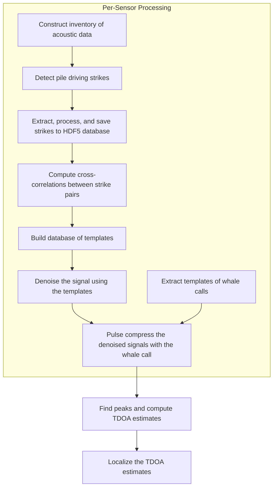

# RODEO II - Vineyard Wind Data Analysis Workflow

William Jenkins, Ph.D.  
Scripps Institution of Oceanography
University of California San Diego

This repository depends on the [`rodeo`](https://github.com/NeptuneProjects/RODEO-II) Python package.

## Workflow

The general workflow is as follows:


## Configuration

The entire workflow can be configured using two configuration files: `config/config.toml` and `config/inventory.toml`.

`config/config.toml` contains general settings for the workflow, such as paths to data directories, parameters for processing steps, and settings for parallelization.
`config/inventory.toml` specifies the acoustic data files to be processed and the parameters for processing them.

## Running workflow end-to-end

The entire workflow can be run end-to-end using the command:  
```bash
workflow --config config/config.toml
```

The optional `--config` flag specifies the path to the configuration file, which contains settings for the workflow.
If the flag is not provided, the workflow will look for a default configuration file at `config/config.toml`.

## Running individual steps


<!-- 
### Construct an inventory of data files.

1. Configure the dataset inventory using the file `config/inventory.toml`.
2. Build the dataset inventory by running:  
   `python scripts/setup/acoustic_inventory.py`  
   The inventory is performed for each station, and saved as:  
   `data/inventory/inventory_SHRU905_VLA1.csv`
3. Detect pile driving strikes in the acoustic data by running:  
   `python scripts/process/strikes_find.py`
4. Extract, process, and save all strikes to an HDF5 database:  
   `python scripts/process/strikes_save.py`
   
5. Compute cross-correlations between all strike pairs:  
   `python scripts/process/strikes_corr.py`
6. Build database of templates:  
   `python scripts/process/template_extraction.py`
7. Extract templates of the whale calls:  
   `python scripts/process/whale_extract.py`
8. Denoise the signal using the templates:  
   `python scripts/process/denoise.py`
9. Pulse compress the denoised signals with the whale call:  
   `python scripts/process/denoised_pulse_compression.py`
10. Find peaks and compute TDOA estimates:  
   `python scripts/process/tdoa_compute.py`
11. Localize the TDOA estimates:  
    `python scripts/process/tdoa_localize.py`
-->